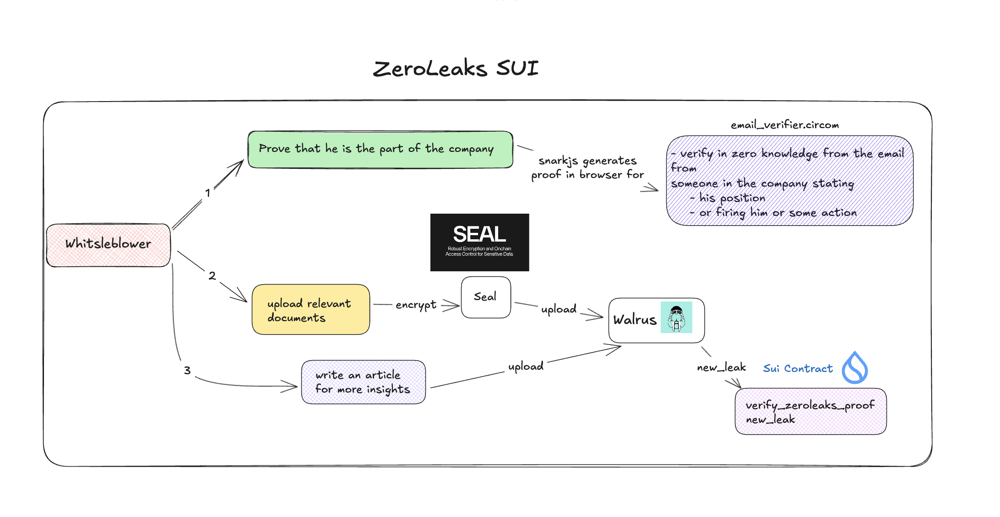

# ZeroLeaks

## Overview

ZeroLeaks is a secure and privacy-focused platform for whistleblowers and journalists to anonymously share sensitive information. Built on the Sui blockchain with zero-knowledge proofs, ZeroLeaks ensures the authenticity of leaked documents while preserving the anonymity of sources.

## Features

- **Zero-knowledge email verification**: Prove the authenticity of leaked documents without revealing source identities
- **Secure document submission**: Upload and share sensitive documents with end-to-end encryption through seal and document are stored on walrus
- **Blockchain-based verification**: All leak verifications are stored on the Sui blockchain
- **User-friendly interface**: Simple step-by-step process for submitting leaks
- **Anonymous reading**: Browse verified leaks without tracking

## Architecture


ZeroLeaks consists of three main components:

1. **Circuits** - Zero-knowledge proofs implemented with Circom for email verification
2. **Smart Contracts** - Sui Move contracts for on-chain verification and data storage
3. **Web Interface** - React-based UI for submitting and browsing leaks

## Usage

### Submitting a Leak

1. Navigate to the "Submit Leak" page
2. Upload your email file (.eml)
3. Choose additional documents to include
4. Generate zero-knowledge proof
5. Write an article summarizing the leak
6. Submit for verification and publication

### Browsing Leaks

Browse through categorized leaks on the main page or search for specific topics.

## Development

### Compiling Circuits

```bash
cd circuits
pnpm build
```

### Testing Smart Contracts

```bash
cd contracts
sui move test
```

## Security

ZeroLeaks uses several security measures:

- Zero-knowledge proofs for email verification
- Blockchain-based immutable verification
- Content storage on decentralized systems

## License

[MIT License](LICENSE)

## Contributing

Contributions are welcome! Please feel free to submit a Pull Request.

## Contact

For questions or support, please open an issue on the GitHub repository.
